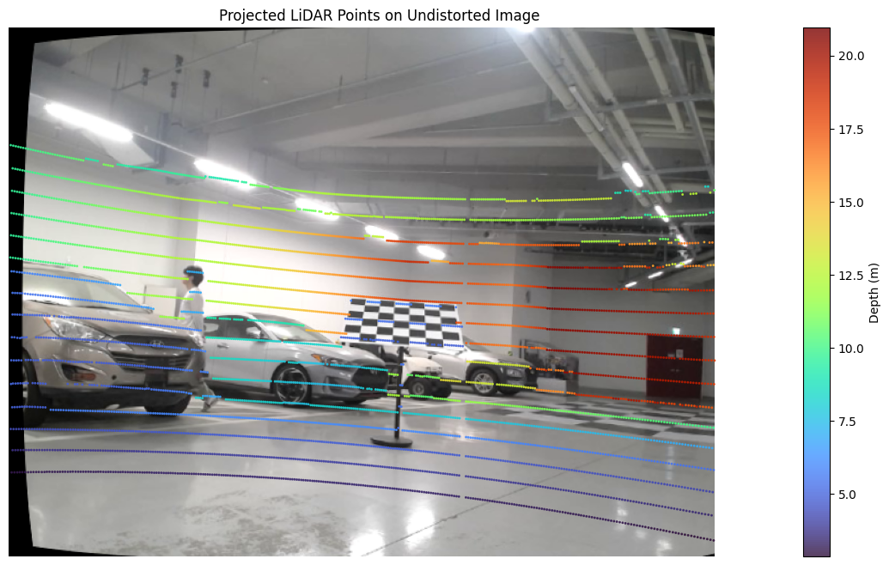

# Lidar-Camera Calibration
The LiDAR-Camera calibration code is based on:

> Zhou, Lipu, Zimo Li, and Michael Kaess.  
> "Automatic extrinsic calibration of a camera and a 3D LiDAR using line and plane correspondences."  
> 2018 IEEE/RSJ International Conference on Intelligent Robots and Systems (IROS). IEEE, 2018.

While the original method required extracting corner lines, which could lead to limited accuracy, this implementation modifies the approach to use only `normal vectors` and `plane` constraints for calibration, thus improving robustness and reliability.
## Setup

### 1. Install Conda Environment

```bash
conda env create -f environment.yaml
conda activate calibration
```  
Run the visualization script to prepare the RoI point cloud datasets:
```
jupyter notebook scripts/cam_lidar_visualize.ipynb
```
After running the notebook and executing the **"Save the data"** section, the folder structure should be as follows:
> ⚠️ **Important:**  
> Make sure to detect the calibration plane **only within the ROI** (Region of Interest).  
> Plane extraction **must be performed using the ROI**, as it is specifically defined to isolate the calibration target from irrelevant LiDAR points.
```
data/
├── Image/*.png
├── RoIPCD/*.npy
└── WholePCD/*.npy
```
## Calibration

### 1. Intrinsic Calibration
Run the intrinsic calibration script to calibrate the images:

```bash
python intrinsic_calibration.py
```
Before running, you must update the configuration `YAML file` to reflect the new intrinsic parameters, similar to the ROS format.

```
configs/*.yaml
```

### 2. LiDAR Camera calibration
Next, run the LiDAR-Camera calibration by executing the shell script:
```
./run_calibration.sh
```
After execution, the results will be saved inside the output folder.  
The rotation and translation matrices will be available as both `.txt` and `.npy` files for further usage.

## Result
Sample result after successful calibration:

To verify the result by overlaying the projected point clouds onto the images, run the following:
```
jupyter notebook scripts/cam_lidar_visualize.ipynb
```
In the notebook, navigate to the section **"Mapping the point clouds to image"**, and update the `result_path` variable to match your saved output directory:
```
result_path = 'results/28-04-2025-20-44-40'
```

## Notes
- We used a Velodyne LiDAR sensor for this calibration setup.
- Ensure your LiDAR point clouds and camera images are time-synchronized and spatially aligned for optimal results.